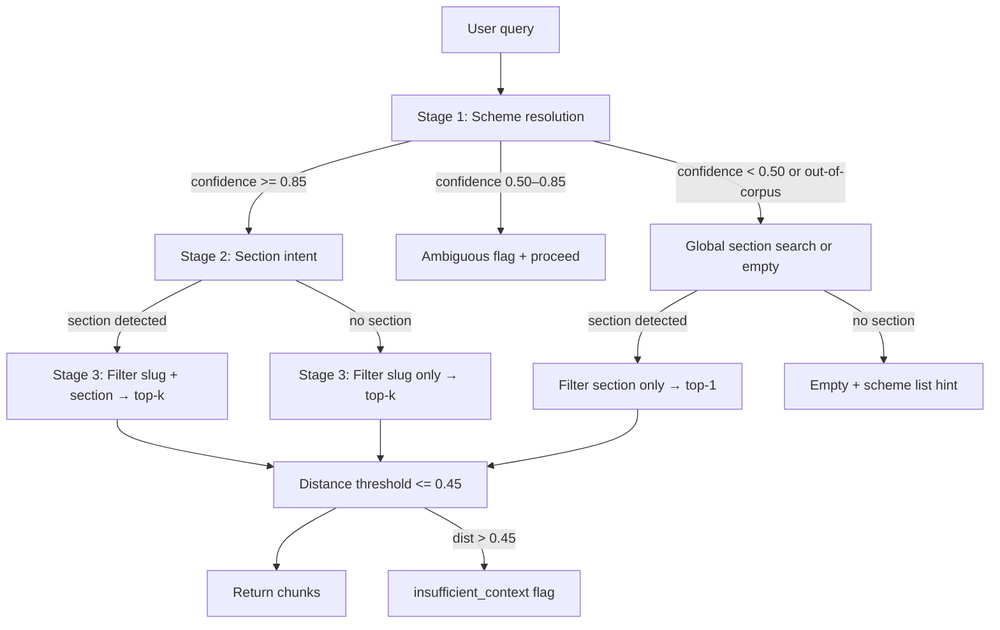
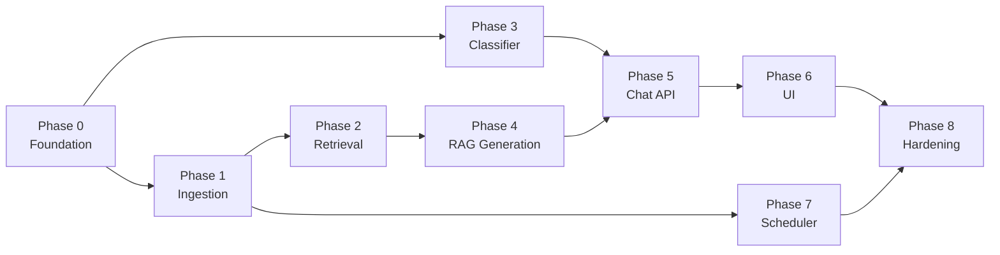

# Phase-Wise Implementation Plan

**Project:** Mutual Fund FAQ Assistant (Facts-Only Q&A)  
**References:** [problemstatement.md](./problemstatement.md) · [architecture.md](../architecture.md)

This plan breaks the build into sequential phases. Each phase has clear tasks, deliverables, and exit criteria. Complete phases in order — later phases depend on earlier ones.

---

## Overview


| Phase | Name                 | Outcome                                                   |
| ----- | -------------------- | --------------------------------------------------------- |
| 0     | Project foundation   | Repo structure, config, and tooling ready                 |
| 1     | Corpus & ingestion   | 12 Groww pages fetched, parsed, chunked, and indexed      |
| 2     | Retrieval layer      | Scheme-aware semantic search over the vector store        |
| 3     | Compliance & refusal | Advisory/comparison queries blocked before RAG            |
| 4     | RAG generation       | Grounded answers with validation and formatting           |
| 5     | Chat API             | `POST /api/chat` end-to-end for factual and refusal paths |
| 6     | Minimal UI           | Chat interface with disclaimer and example questions      |
| 7     | Daily scheduler      | Automated daily ingestion trigger                         |
| 8     | Hardening & launch   | Tests, security, observability, README                    |


**Corpus scope (current):** 12 HDFC scheme pages on Groww (see problem statement).  
**Architecture note:** `architecture.md` references 5 schemes in some sections; align config and docs to **12 URLs** during Phase 0.

---

## Phase 0 — Project Foundation

**Goal:** Establish the project skeleton, dependencies, and shared configuration.

### Tasks

- [ ] Create directory structure per architecture (§13):
  - `ingestion/`, `scheduler/`, `app/`, `ui/`, `config/`, `data/`, `tests/`, `docs/`
- [ ] Initialize Python project (`pyproject.toml` or `requirements.txt`) with:
  - FastAPI, uvicorn
  - ChromaDB (or chosen vector store)
  - sentence-transformers / embedding client
  - BeautifulSoup (or Playwright if JS rendering is required)
  - python-dotenv, pydantic, httpx
- [ ] Add `config/corpus.yaml` with all **12 scheme URLs**, slugs, and display names
- [ ] Add `.env.example` for LLM API keys and scheduler settings (no secrets in repo)
- [ ] Add `.gitignore` for `data/`, `.env`, vector index artifacts
- [ ] Update `architecture.md` corpus table from 5 → 12 schemes (consistency pass)

### Deliverables

- Runnable empty FastAPI app (`app/main.py` health check)
- `config/corpus.yaml` with 12 URLs
- Environment and setup documented in draft README section

### Exit criteria

- `uvicorn app.main:app` starts without errors
- All 12 corpus URLs are defined in a single config source of truth

---

## Phase 1 — Corpus & Ingestion Pipeline

**Goal:** Build the offline ingestion component that rebuilds the index from Groww scheme pages.

### Tasks

- [x] **`ingestion/fetch.py`** — HTTP GET each corpus URL; save raw HTML/markdown to `data/raw/` with fetch timestamp
- [x] **`ingestion/parse.py`** — Clean page chrome; extract sections:
  - `overview`, `expense_ratio`, `exit_load`, `minimum_investment`, `benchmark`, `tax`, `fund_management`, `investment_objective`, `fund_house`
- [x] **`ingestion/chunk.py`** — Section-aware chunking (see strategy below)
- [x] **`ingestion/index.py`** — Generate embeddings; upsert into ChromaDB with metadata:
  - `source_url`, `scheme_name`, `section`, `last_updated`, `chunk_text`
- [x] **`ingestion/run.py`** — Orchestrate fetch → parse → chunk → embed → index; update scheme metadata index (`last_fetched_at`)
- [x] Manual CLI: `python -m ingestion.run` completes successfully for all 12 URLs
- [x] Store processed chunks in `data/processed/` for debugging

### Chunking strategy

Based on cleaned `sections.json` output (12 schemes × 9 sections, ~20–480 words per section):

| Rule | Applies to | Behavior |
|------|------------|----------|
| **1 section = 1 chunk** | `overview`, `expense_ratio`, `exit_load`, `minimum_investment`, `benchmark`, `tax`, `investment_objective`, `fund_house` | Keep full section text when ≤400 tokens (~95% of cases) |
| **1 manager = 1 chunk** | `fund_management` | Split on `\n\n` boundaries; never merge multiple manager bios |
| **Overlap split (fallback)** | Any section >400 tokens | 300-token windows, 50-token overlap, within same section only |
| **No cross-section merges** | All | Preserves section metadata for Phase 2 retrieval boosting |

Chunk ID format: `{slug}#{section}#{index}` (manager chunks use manager-name suffix).

Each chunk body is prefixed for embedding quality:
```
Scheme: <scheme_name>
Section: <section>
<content>
```

Expected corpus size: **~127 chunks** (96 single-section + ~31 manager chunks).

Debug output: `data/processed/{slug}/chunks.json`

### Deliverables

- Populated vector store under `data/index/`
- Scheme metadata index (JSON) with `slug`, `scheme_name`, `source_url`, `last_fetched_at`
- Ingestion logs: URLs fetched, chunk count per scheme

### Exit criteria

- [x] All 12 URLs ingested without fatal errors
- [x] Vector store contains chunks for all required sections (especially `fund_management`, `expense_ratio`, `exit_load`)
- [x] Re-running ingestion upserts cleanly (idempotent)

---

## Phase 2 — Retrieval Layer

**Goal:** Retrieve the most relevant chunks for a factual user query with scheme disambiguation.

**Corpus context (from Phase 1):** 125 chunks · 12 schemes · ~10 chunks/scheme · median ~49 words/chunk · BGE-small (`BAAI/bge-small-en-v1.5`) · ChromaDB cosine index.

### Retrieval strategy (3-stage hybrid)

Metadata-first, semantic-second — suited to a small, section-labelled corpus.



**Stage 1 — Scheme resolution** (from `config/corpus.yaml` + `data/index/scheme_metadata.json`):

| Priority | Method | Confidence |
|----------|--------|------------|
| 1 | Groww URL in query | 1.0 |
| 2 | Full scheme name substring | 1.0 |
| 3 | Longest alias match (e.g. "defence", "mid cap", "gold etf") | 0.9 |
| 4 | Token overlap (requires "hdfc" in query; stopwords excluded) | 0.5–0.8 |

Confidence thresholds: **≥ 0.85** → hard `slug` filter; **0.50–0.85** → proceed with `ambiguous=True`; **< 0.50** → no scheme filter (global section search if section detected, else empty). Queries naming other AMCs (SBI, ICICI, etc.) without a corpus scheme match → empty retrieval.

**Stage 2 — Section intent** (keyword map, longest match wins):

| Section | Trigger keywords |
|---------|------------------|
| `expense_ratio` | expense ratio, ter |
| `exit_load` | exit load, redemption charge |
| `minimum_investment` | minimum sip, min sip, lumpsum |
| `benchmark` | benchmark |
| `fund_management` | fund manager, who manages, manager, tenure |
| `investment_objective` | investment objective, strategy |
| `tax` | tax, stcg, ltcg |
| `overview` | riskometer, risk label, nav, aum |
| `fund_house` | fund house, amc, registrar |

When section is detected → hard-filter ChromaDB by `section` (in addition to `slug` when resolved).

**Stage 3 — Semantic search** (ChromaDB + BGE query prefix):

- Query embedding: `"Represent this sentence for searching relevant passages: " + query`
- Document embeddings: stored as indexed (Scheme/Section prefix included)
- **k:** `fund_management` → 5 (multi-manager bios); all other sections → 2
- **Distance cutoff:** cosine distance > **0.45** → `insufficient_context=True` (R-14)

### Tasks

- [x] **`app/retriever.py`** — 3-stage hybrid retrieval (`retrieve(query) -> RetrievalResult`)
- [x] Load scheme metadata index and corpus config at startup
- [x] Handle ambiguous queries (no scheme detected) — global section search + `ambiguous=True`
- [x] Handle out-of-corpus scheme names — empty retrieval with scheme list hint
- [x] **`GET /ready`** — vector store loaded and chunk count > 0
- [x] **`GET /dev/retrieve?q=...`** — dev-only debug endpoint showing resolved scheme, section, and top chunks
- [x] **`tests/test_retrieval.py`** — scheme resolution, section intent, and end-to-end retrieval cases

### Deliverables

- `app/retriever.py` with unit-testable `retrieve(query) -> RetrievalResult` API
- Dev debug endpoint: `GET /dev/retrieve?q=<query>`
- CLI: `python -m app.retriever "Expense ratio of HDFC Mid Cap Fund?"`

### Exit criteria

- [x] Named-scheme queries return chunks from the correct `source_url`
- [x] Fund management queries retrieve `fund_management` section chunks
- [x] Unknown scheme returns no corpus chunks (ready for out-of-scope handling in Phase 3)

---

## Phase 3 — Compliance & Refusal Handling

**Goal:** Classify queries and refuse advisory, comparison, and performance-seeking questions before RAG.

### Tasks

- [x] **`app/classifier.py`** — Rule-based classifier (Phase 3 baseline):
  - **Factual** → proceed to RAG
  - **Advisory** — "should I invest", "good fund", "recommend"
  - **Comparison** — "which is better", "vs", "compare returns"
  - **Performance-seeking** — return projections, past return comparisons
  - **Out of scope** — scheme not in corpus, unrelated topic
- [x] **`app/refusal.py`** — Templated refusal responses:
  - Polite facts-only limitation message
  - Exactly one educational link (AMFI or SEBI)
  - No retrieval or invented fund data
- [x] **`app/sanitize.py`** — reject PII patterns (PAN, Aadhaar, account #, OTP, email, phone) before any LLM call
- [x] **`tests/test_classifier.py`** — Cover classifier labels with example phrases
- [x] **`tests/test_refusal.py`** — Verify refusal JSON shape and educational link

### Deliverables

- Classifier + refusal handler integrated as pre-RAG gate
- Test suite for advisory/comparison/performance refusal cases

### Exit criteria

- [x] Advisory and comparison queries never reach the retriever
- [x] Refusal responses include AMFI/SEBI link and `is_refusal: true`
- [x] PII-like input is blocked or stripped

---

## Phase 4 — RAG Generation, Validation & Formatting

**Goal:** Produce grounded, compliant answers for factual queries.

**LLM provider:** [Groq](https://console.groq.com/) — fast inference for short factual answers. Configure via `GROQ_API_KEY` and `GROQ_MODEL` (default: `llama-3.3-70b-versatile`).

### Tasks

- [x] **`app/generator.py`** — Groq chat completion with:
  - System prompt: facts-only, context-only, no advice, max 3 sentences, no URLs in answer
  - Retrieved chunks + user question formatted as context block
  - `temperature=0` for deterministic factual output
- [x] **`app/validator.py`** — Post-generation checks:
  - Answer ≤ 3 sentences (truncate if over)
  - Citation URL in corpus allowlist (12 Groww URLs from `config/corpus.yaml`)
  - No advisory language (regex patterns: recommend, should invest, buy/sell/hold, etc.)
  - Grounding: numeric facts in answer must appear in retrieved chunk text
  - No performance numbers quoted unless grounded in chunks and section allows it
- [x] **`app/formatter.py`** — Enforce response contract:
  - `answer`, `citation_url`, `last_updated` (from chunk metadata, not LLM)
  - `is_refusal: false` for factual path
  - `disclaimer`: "Facts-only. No investment advice."
- [x] **`app/orchestrator.py`** — Wire retriever → generator → validator → formatter
  - Regenerate once on validation failure; link-only fallback after second failure
  - Link-only fallback when retrieval is empty or `insufficient_context`
- [x] **`tests/test_rag.py`** — Validator, formatter, and orchestrator tests (mocked Groq)
- [x] **`GET /dev/chat?q=...`** — Dev-only end-to-end RAG endpoint (no classifier yet)

### Environment

```bash
GROQ_API_KEY=your_key_here
GROQ_MODEL=llama-3.3-70b-versatile   # or llama-3.1-8b-instant for lower latency
```

### Deliverables

- Structured JSON response matching API contract (architecture §5)
- Validator fallbacks: regenerate, truncate, or link-only response on failure
- CLI: `python -m app.orchestrator "Expense ratio of HDFC Mid Cap Fund?"`

### Exit criteria

- [x] Factual queries return ≤3 sentences, one citation, and correct `last_updated`
- [x] Fund management queries cite manager name/tenure from retrieved chunks
- [x] Performance queries do not quote ungrounded returns; link-only fallback when needed
- [x] Validator catches hallucinated citations and advisory language

---

## Phase 5 — Chat API

**Goal:** Expose a single stateless chat endpoint that routes factual vs refusal paths.

### Tasks

- [x] **`app/main.py`** — `POST /api/chat` accepting `{ "message": string }`
- [x] **`app/chat.py`** — Route: sanitize → classify → refusal handler **or** RAG orchestrator
- [x] CORS config for local UI (`CORS_ORIGINS` env var)
- [x] Basic rate limiting per-IP (`RATE_LIMIT_PER_MINUTE`, default 60)
- [x] Structured logging (no PII): query class, scheme resolved, retrieval scores, latency
- [x] Health endpoints: `/health`, `/ready` (vector store loaded)

### Example requests

Factual:
```bash
curl -X POST http://localhost:8000/api/chat \
  -H "Content-Type: application/json" \
  -d '{"message":"What is the expense ratio of HDFC Mid Cap Fund Direct Growth?"}'
```

Refusal:
```bash
curl -X POST http://localhost:8000/api/chat \
  -H "Content-Type: application/json" \
  -d '{"message":"Should I invest in HDFC Mid Cap Fund?"}'
```

### Deliverables

- Working API testable via curl/Postman
- Example requests/responses documented above

### Exit criteria

- [x] Factual and refusal paths both return valid JSON
- [x] p95 latency target: < 5 s (architecture §10) under normal load
- [x] API is stateless — no user identity or PII stored

---

## Phase 6 — Minimal UI

**Goal:** Ship a simple chat interface aligned with problem statement UI requirements.

### Tasks

- [ ] `**ui/index.html`** (or lightweight React/Next.js if preferred) with:
  - Welcome message
  - Visible disclaimer: **"Facts-only. No investment advice."**
  - Three clickable example questions (scheme fact + fund management):
    - Expense ratio (e.g. HDFC Mid Cap Fund)
    - Exit load (e.g. HDFC Defence Fund)
    - Fund manager (e.g. HDFC Gold ETF FoF)
  - Free-text input and chat message rendering
  - Display answer, citation link, and last-updated footer
- [ ] No fields for email, phone, PAN, or account details
- [ ] Serve UI from FastAPI static mount or separate static host

### Deliverables

- Functional chat UI connected to `POST /api/chat`
- Refusal messages rendered with educational link

### Exit criteria

- All three example questions return correct factual answers from the UI
- Disclaimer is always visible
- Success criterion: "Clean, minimal, and user-friendly interface" (problem statement)

---

## Phase 7 — Daily Scheduler

**Goal:** Automate corpus refresh via a daily trigger for the ingestion component.

### Tasks

- [x] **`scheduler/daily.py`** — Wrapper that invokes `ingestion/run.py` as a single atomic job
- [x] Configure trigger (choose one for deployment target):
  - Local/dev: cron or APScheduler (`python -m scheduler.daily --daemon` at **10:00 AM IST**)
  - CI: GitHub Actions scheduled workflow (`.github/workflows/daily-ingestion.yml`)
  - Prod: cloud scheduler (EventBridge / Cloud Scheduler)
- [x] Logging: start time, completion status, URLs fetched, chunk count, errors (`data/scheduler_log.json`)
- [x] Failure handling: optional single retry; log error details
- [x] Index swap strategy: build to `data/index_staging`, serve previous index until atomic swap completes
- [x] Document manual CLI fallback: `python -m ingestion.run`

### Deliverables

- Scheduler configured for daily run at **10:00 AM IST** (`SCHEDULER_HOUR=10`, `SCHEDULER_TIMEZONE=Asia/Kolkata`)
- Scheduler logs verifiable after at least one successful scheduled run

### Exit criteria

- [x] Ingestion runs automatically once per 24 hours without manual intervention
- [x] Chat API continues serving during ingestion (staging build + hot retriever reload after swap)
- [x] `last_fetched_at` in metadata index updates after each successful run

---

## Phase 8 — Hardening, Testing & Launch

**Goal:** Meet success criteria, document the system, and prepare for demo/production.

### Tasks

- [ ] Expand test coverage:
  - All 12 schemes resolvable by name/slug
  - Query routing matrix (architecture §6) — spot-check each intent row
  - Ingestion idempotency and scheduler trigger
- [ ] Security review:
  - Citation allowlist enforced
  - No PII collection or persistence
  - Rate limiting active
- [ ] Observability: ingestion job status, API error rates, refusal rate
- [ ] `**README.md`** (expected deliverable):
  - Setup instructions
  - Selected AMC (HDFC) and 12 Groww URLs
  - Architecture overview (RAG + daily scheduler)
  - Known limitations (Groww as source, no performance comparisons, corpus scope)
  - Disclaimer snippet
- [ ] Map README and tests to problem statement success criteria checklist

### Deliverables

- Complete README
- Test suite passing in CI (optional GitHub Actions)
- Demo-ready deployment (local or minimal cloud)

### Exit criteria (maps to problem statement success criteria)

- [ ] Accurate retrieval of factual mutual fund and fund management information
- [ ] Strict adherence to facts-only responses
- [ ] Consistent inclusion of valid source citations
- [ ] Proper refusal of advisory queries
- [ ] Clean, minimal, and user-friendly interface

---

## Phase Dependencies




Phases 3 and 2 can run **in parallel** after Phase 1. Phase 7 can start once Phase 1 is stable (does not block UI work).

---

## Suggested Build Order (Quick Reference)

1. **Week 1:** Phase 0 → Phase 1 (ingestion working for 12 URLs)
2. **Week 2:** Phase 2 + Phase 3 in parallel → Phase 4
3. **Week 3:** Phase 5 → Phase 6 (demo-able chat)
4. **Week 4:** Phase 7 → Phase 8 (scheduler, tests, README)

Adjust timelines based on team size; a single developer can treat each phase as 2–4 days of focused work.

---

## Out of Scope (Future Phases)

These are documented in architecture §12 and problem statement but **not** part of the current implementation plan:

- Expand corpus to 15–25 official AMC / AMFI / SEBI URLs
- Clarification turn ("Which scheme did you mean?")
- Structured JSON fact cache per scheme
- Multilingual (Hindi) support
- Admin dashboard for ingestion status and chunk inspection
- Document download guide URLs (statements, capital gains reports)

---

## Summary

Build bottom-up: **index the 12-scheme corpus first**, then **retrieve**, **classify**, **generate**, and **expose via API + UI**. Add the **daily scheduler** once ingestion is reliable. Finish with **tests, security, and README** to meet the facts-only, source-backed, compliance-first goals defined in the problem statement and architecture.